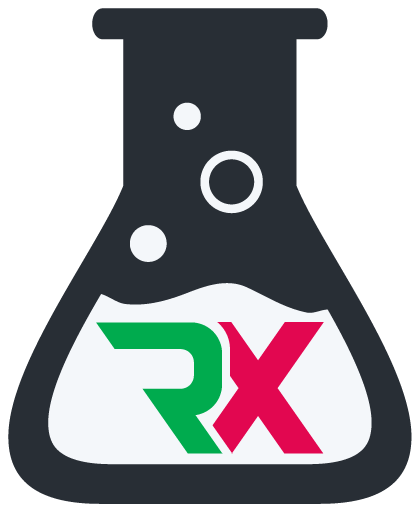
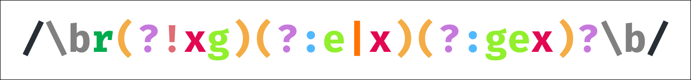
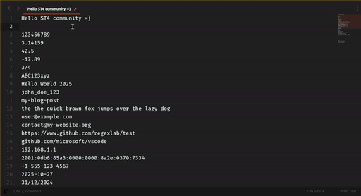
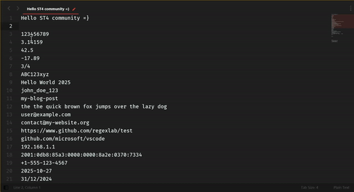
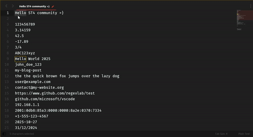
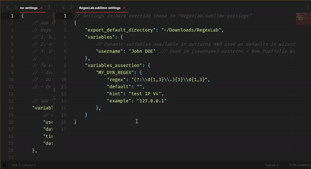

<!-- markdownlint-disable MD013 MD031 MD032 MD033 MD040 MD041 MD051 -->
<div align="center">
  

# RegexLab

**Your regex pattern library, organized and ready to go** (for [Sublime Text 4][subl])

Never dig through old files or re-Google regex patterns again. Save them in portfolios, load them instantly, and get back to coding.



</div>

---

[](https://github.com/KaminoU/RegexLab/actions)
[](https://opensource.org/licenses/MIT)
[](https://www.python.org/downloads/)
[](https://www.sublimetext.com/)

[subl]: https://www.sublimetext.com/

---

## ✨ Features at a Glance

| Feature | What it does | Demo |
|---------|--------------|------|
| **🎯 Load Pattern** (`Ctrl+Shift+R`) | Browse and inject patterns into Find or configured panel (Portfolio Manager for override) | [](docs/assets/demos/load_pattern.gif) |
| **📦 Portfolio Manager** (`Ctrl+Alt+P`) | Manage multiple pattern collections with one click | [](docs/assets/demos/portfolio_manager.gif) |
| **🧙 New Portfolio/Pattern Wizard** | Step-by-step guided portfolio/pattern creation | [](docs/assets/demos/new_portfolio.gif) |
| **✏️ Use Selection** (`Ctrl+Shift+Alt+R`) | Quick actions from selected text: save as pattern or inject into panels | [](docs/assets/demos/selection_pattern.gif) |
| **🧪 Dynamic Patterns** | Use custom variables like `{{JUST_A_VAR}}` in patterns | [](docs/assets/demos/dynamic_pattern.gif) |

---

## 📦 Installation

### 1. Package Control (default channel)

🚧 **Coming soon** – RegexLab will appear in the default Package Control channel once version 1.0.0 is published. When it ships you’ll simply run `Package Control: Install Package`, search `RegexLab`, and install.

### 2. Package Control (custom repository)

Want to track the repo right now? Add it as a custom source:

1. Open the Command Palette → `Package Control: Add Repository`
2. Paste `https://github.com/KaminoU/RegexLab`
3. Command Palette → `Package Control: Install Package`
4. Search for **RegexLab** → Install

Package Control remembers the custom repository, so future updates come through the same workflow. Once RegexLab lands in the default channel you can remove the custom entry if you prefer.

### 3. Manual installation (git/zip)

1. **Clone or download** this repository:

    ```bash
    git clone https://github.com/KaminoU/RegexLab.git
    ```

2. **Locate** your Sublime Text `Packages` directory:
    - **Windows**: `%APPDATA%\Sublime Text\Packages\`
    - **macOS**: `~/Library/Application Support/Sublime Text/Packages/`
    - **Linux**: `~/.config/sublime-text/Packages/`

    💡 **Tip**: `Preferences > Browse Packages...` opens the right folder.

3. **Copy** the `RegexLab` folder into `Packages`

4. **Restart** Sublime Text – the built-in portfolios load automatically on startup. 🎉

---

## 🚀 Quick Start

### 1️⃣ Load a pattern (`Ctrl+Shift+R`)

Press `Ctrl+Shift+R` (or `Cmd+Shift+R` on macOS) to open the pattern selector:

1. Browse patterns from all active portfolios
2. Select a pattern
3. The regex is injected into the Find panel
4. Adjust scope and search!

### 2️⃣ Create a pattern from selection (`Ctrl+Shift+Alt+R`)

1. Select text in your file (e.g., `API_KEY`)
2. Press `Ctrl+Shift+Alt+R` (or `Cmd+Shift+Alt+R` on macOS)
3. Choose an action:
   - **✨ Create New Pattern** / Save to portfolio with a name
   - **🔍 Use as Find Pattern** / Inject directly into Find panel
   - **🔄 Use as Replace Pattern** / Inject into Replace panel
   - **📁 Use as Find in Files** / Inject into Find in Files panel

### 3️⃣ Manage portfolios (`Ctrl+Alt+P`)

Press `Ctrl+Alt+P` (or `Cmd+Alt+P` on macOS) to open the Portfolio Manager:

- View all loaded and disabled portfolios
- Enable/disable portfolios with one click
- Create new portfolios via wizard
- Reload portfolios without restarting Sublime Text

---

## ⌨️ Keyboard Shortcuts

RegexLab provides convenient keyboard shortcuts for lightning-fast access:

| Shortcut | Command | What it does |
|----------|---------|--------------|
| `Ctrl+Shift+R` (`Cmd+Shift+R`) | **Load Pattern** | Open pattern selector and inject regex into Find panel |
| `Ctrl+Alt+P` (`Cmd+Alt+P`) | **Portfolio Manager** | Visual hub for managing all portfolios |
| `Ctrl+Shift+Alt+R` (`Cmd+Shift+Alt+R`) | **Use Selection** | Quick actions on selected text: save as pattern or inject into panels |

💡 **Tip**: Customize these shortcuts in `Preferences > Package Settings > RegexLab > Key Bindings`

---

## 📚 Usage Guide

### Managing Portfolios

RegexLab auto-discovers portfolios from these locations:

**Built-in** (always loaded, integrity-protected):
```
RegexLab/data/portfolios/*.json
```

**Custom active** (auto-loaded on startup):
```
User/RegexLab/portfolios/*.json
```

**Disabled** (ignored, not loaded):
```
User/RegexLab/disabled_portfolios/*.json
```

**Enable/disable portfolios:**
- Use Portfolio Manager (`Ctrl+Alt+P`) → "Enable/Disable Portfolio"
- Or drag `.json` files between `portfolios/` and `disabled_portfolios/`

**Create new portfolio:**
- Command Palette → "RegexLab: New Portfolio"
- Follow the 5-step wizard (name, description, author, tags, confirmation)
- Portfolio automatically saved to `User/RegexLab/portfolios/`

📖 **Learn more**: [Portfolio Management Guide](data/portfolios/README.md)

### Working with Dynamic Variables

Dynamic patterns use variables that are resolved when you load the pattern. Think of them as **reusable templates**.

**Example pattern:**
```regex
\[{{LEVEL}}\] {{DATE}} - {{MESSAGE}}
```

When you load this pattern, RegexLab prompts you for each variable value:
- `LEVEL` → Enter: `INFO`
- `DATE` → Pre-filled with today's date: `2025-10-26`
- `MESSAGE` → Enter: `User logged in`

**Final resolved regex:**
```regex
\[INFO\] 2025-10-26 - User logged in
```

#### Built-in variables (auto-filled behavior)

The following variables are auto-filled with the current date/time by default. You can adjust their formats in `RegexLab.sublime-settings`:

- `{{DATE}}` — Uses `variables.date_format` (default: `%Y-%m-%d`). Default value is `"NOW"` via `variables_assertion.DATE.default`.
- `{{TIME}}` — Uses `variables.time_format` (default: `%H:%M:%S`). Default value is `"NOW"` via `variables_assertion.TIME.default`.

Note: These built-in defaults are provided out of the box and can be overridden in `RegexLab.sublime-settings`. For other variables (e.g., `{{USERNAME}}`, `{{LEVEL}}`, `{{EMAIL}}`, `{{IP}}`, `{{PORT}}`, `{{UUID}}`), prompting and validation are fully controlled by your `variables_assertion` configuration.

#### Custom Variables

You can use **any variable name** you want:
- `{{TASK}}`, `{{PRIORITY}}`, `{{AUTHOR}}`, `{{SERVER}}`, etc.
- RegexLab prompts you for the value when loading the pattern
- No pre-configuration needed ; just use them!

#### Variable Validation (Optional)

Want to **validate user input** for variables? Define constraints in settings!

**Example:** Force `{{DATE}}` to be in `YYYY-MM-DD` format:

```json
// Settings: Preferences > Package Settings > RegexLab > Settings
{
    "variables_assertion": {
        "DATE": {
            "regex": "[0-9]{4}-[0-9]{2}-[0-9]{2}",
            "default": "NOW",
            "hint": "YYYY-MM-DD format",
            "example": "2025-10-26"
        },
        "LEVEL": {
            "regex": "DEBUG|INFO|WARN|ERROR",
            "default": "INFO",
            "hint": "Log severity level",
            "example": "DEBUG, INFO, WARN, ERROR"
        }
    }
}
```

**What this does:**
- `regex`: Validates input against this pattern
- `default`: Pre-fills the input (use `"NOW"` for auto date/time)
- `hint`: Shows helpful description in prompt
- `example`: Shows example values

**Prompt example with validation:**
```
Enter value for {{DATE}} (hint: YYYY-MM-DD format, e.g. 2025-10-26):
```

#### Configure Date/Time Formats

Customize how `{{DATE}}`, `{{TIME}}`, and `{{DATETIME}}` are formatted:

```json
{
    "variables": {
        "date_format": "%Y-%m-%d",           // Default: 2025-10-26
        "time_format": "%H:%M:%S",           // Default: 15:30:45
        "datetime_format": "%Y-%m-%d %H:%M:%S"  // Default: 2025-10-26 15:30:45
    }
}
```

📖 **Learn more**: See [RegexLab.sublime-settings](RegexLab.sublime-settings) for all available options

### Creating Custom Portfolios

**Method 1: New Portfolio Wizard** (recommended)

1. Command Palette → "RegexLab: New Portfolio"
2. Follow the wizard steps
3. Add patterns via Portfolio Manager

**Method 2: JSON file** (advanced)

Create `User/RegexLab/portfolios/my-portfolio.json`:

```json
{
    "name": "My Custom Portfolio",
    "description": "Project-specific patterns",
    "version": "1.0.0",
    "author": "Your Name",
    "readonly": false,
    "patterns": [
        {
            "name": "API Endpoint",
            "regex": "/api/v\\d+/[\\w/-]+",
            "type": "static",
            "description": "Match REST API endpoints"
        },
        {
            "name": "Email Finder",
            "regex": "[a-z0-9._%+-]+@[a-z0-9.-]+\\.[a-z]{2,}",
            "type": "static",
            "description": "Find emails across files",
            "default_panel": "find_in_files"
        }
    ]
}
```

**💡 Smart Panel Targeting**: Patterns can auto-select the best panel via `default_panel`:
- `"find_in_files"` — Multi-file search (emails, URLs, IPs)
- `"replace"` — Cleanup patterns (whitespace, duplicates)
- Omit for validation patterns (user decides context)

⚠️ **Tip**: Use the **Portfolio Wizard** or **Portfolio Manager** to create/edit patterns ; they handle `default_panel` automatically! Manual JSON editing is error-prone.

Restart Sublime Text or reload portfolios (`Ctrl+Alt+P` → "Reload Portfolios").

📖 **Learn more**: [Portfolio Schema Documentation](data/portfolios/README.md#portfolio-schema)

---

## 💻 Requirements

- **Sublime Text 4** (Build 4050+)

That's it! If Sublime Text 4 runs on your system, RegexLab will work. ✨

---

## 🧪 Testing & Quality

RegexLab has **comprehensive test coverage** and **production-grade quality**:

### Test Coverage

**Core tests** (pytest):
- ✅ **533 tests passing** on Python 3.8 and 3.13
- ✅ **98% coverage** (1214 statements, 29 miss)
- ✅ Per-module breakdown:
  - `models.py`: 100% (core data structures)
  - `pattern_engine.py`: 100% (regex engine)
  - `logger.py`: 100% (logging infrastructure)
  - `portfolio_service.py`: 99% (portfolio operations)
  - `panel_injection.py`: 98% (UI integration)
  - `settings_manager.py`: 97% (settings management)
  - `integrity_manager.py`: 97% (security)
  - `portfolio_manager.py`: 94% (portfolio lifecycle)
  - `helpers.py`: 92% (utilities)

**UI tests** (UnitTesting):
- ✅ **6 tests passing** (Sublime Text integration)
- ✅ Validates commands, portfolio loading, pattern injection

**Total**: 539 tests across all layers 🎯

**Run tests yourself:**
```bash
tox                    # Full test suite (all Python versions)
pytest tests/ -v       # Quick test run
```

### Performance Benchmarks

RegexLab is **blazing fast** with enterprise-grade optimizations:

- ⚡ **333x speedup** on `Pattern.variables` (3.33µs vs 1.11ms)
  - Cached property optimization → O(1) after first access
- ⚡ **13x speedup** on `Pattern.resolve()` (76.9µs vs 1ms)
  - Pre-compiled regex patterns → zero runtime compilation

### Code Quality

- ✅ **CCode audit score: 9.8/10** (production-ready)
- ✅ Zero memory leaks detected
- ✅ <1% code duplication
- ✅ 100% type hints (mypy strict mode)
- ✅ Cross-platform validated (Windows, Linux, macOS)

### Memory Safety

- 🛡️ OOM protection for clipboard operations (10MB limit)
- 🛡️ Defensive programming for edge cases
- 🛡️ Proper resource cleanup (no file handle leaks)

---

## 🌟 Community Portfolios

Got a useful portfolio to share? The community would love to see it!

### Share Your Portfolio

**How to share:**

1. **Create a Gist**: Upload your portfolio JSON to [GitHub Gist](https://gist.github.com)
2. **Share it**: Post the link in [GitHub Discussions](https://github.com/KaminoU/RegexLab/discussions) (coming soon!)
3. **Tag it**: Add relevant tags (Python, Web, DevOps, Data Science, etc.)

**What makes a good community portfolio?**
- 🎯 Focused on a specific domain or use case
- 📝 Well-documented patterns with clear descriptions
- ✅ Tested and verified regex patterns
- 💡 Solves real-world problems

### Featured Community Portfolios

Coming soon! Be the first to share yours! 🚀

**How to use community portfolios:**

1. Download the JSON file from the gist
2. Save it to `User/RegexLab/portfolios/`
3. Restart Sublime Text or reload portfolios (`Ctrl+Alt+P` → "Reload Portfolios")

**Popular ideas for portfolios:**
- Python/Django patterns (imports, decorators, ORM queries)
- Web scraping toolkit (HTML tags, data extraction)
- Data science patterns (CSV, JSON, scientific notation)
- DevOps/Infrastructure (config files, YAML, Docker)
- Security/Forensics (IP addresses, credentials, hashes)

**Best portfolios may be included in future builtin releases!** 🏆

---

## 🤝 Contributing

Contributions are super welcome! 🎉

**Before you start**, please read our [Contributing Guide](.github/CONTRIBUTING.md) for:
- Code style guidelines
- Testing requirements
- Pull request process
- Development setup

### Quick Development Setup

```bash
# Clone the repository
git clone https://github.com/KaminoU/RegexLab.git
cd RegexLab

# Install tox (if not already installed)
pip install tox

# Run full test suite (Python 3.8 + 3.13, linting, type checking)
tox

# Run specific tests
tox -e py38-core     # Tests on Python 3.8
tox -e py313-core    # Tests on Python 3.13
tox -e lint          # Linting only (ruff)
tox -e typecheck     # Type checking only (mypy)

# Quick development workflow
pytest tests/ -v     # Run all tests
ruff check src/ tests/ --diff  # Lint (matches CI guardrail)
mypy src/            # Type check

# WSL2/headless testing (no Sublime Text UI)
bash scripts/test-wsl2.sh     # Linux/WSL2
pwsh scripts/test-wsl2.ps1    # PowerShell
```

**Coverage targets for new code:**
- Core modules (`models.py`, `pattern_engine.py`): **95%+**
- Utilities (`helpers.py`, `logger.py`): **65%+**
- Commands (UI): **50%+**

📖 **Full guide**: [CONTRIBUTING.md](.github/CONTRIBUTING.md)

---

## 📄 License

Copyright © 2025 宀Кami宀 (Michel TRUONG)

Licensed under the MIT License. See [LICENSE](LICENSE.md) for details.

---

## 📝 Changelog

See [CHANGELOG.md](CHANGELOG.md) for version history and release notes.

---

## 🙏 Credits

- **Author**: Michel TRUONG ([KaminoU](https://github.com/KaminoU))
- **Contributors**: Thank you to everyone who helps improve RegexLab! ❤️

---

<div align="center">

Made with ❤️ for the Sublime Text community.

o( ^   ^ )o Cheers!!! o( ^   ^ )o

</div>
